# 🏏 Virat Kohli Career Performance Dashboard (React + FastAPI + MySQL)

An interactive **Full Stack Cricket Analytics Dashboard** built to perform an in-depth analysis of **Virat Kohli's complete international cricket career** using modern web technologies and data analytics techniques.

This project transforms raw match-by-match cricket data into meaningful business-style insights through dynamic visualizations, real-time filtering, KPI cards, and statistical analysis. Users can interactively explore Virat Kohli's performances across different formats, years, opponents, venues, batting positions, and several advanced performance metrics.

The application follows a complete **Frontend + Backend +Database architecture**, where the frontend communicates with REST APIs, the backend dynamically generates SQL queries based on user-selected filters, and the database performs real-time aggregations to return accurate statistics.

Rather than displaying static charts, every visualization updates instantly based on selected filters, providing an interactive analytics experience similar to professional sports intelligence platforms.

---

# 📊 Dashboard Preview


live link [https://virat-kohli-performance-dashboard.vercel.app]

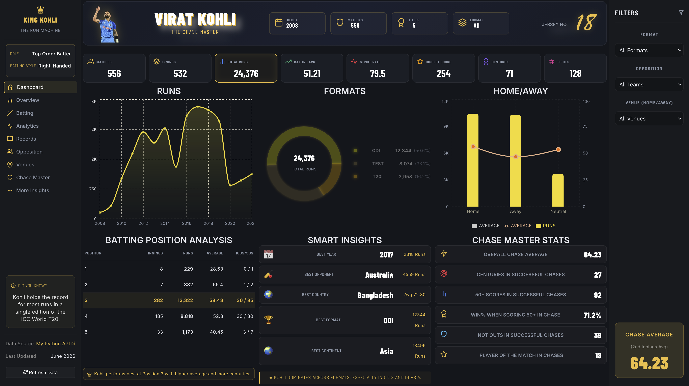

---

# 🚀 Project Overview

Sports analytics has become one of the fastest-growing domains in data science, helping teams, analysts, and fans make data-driven decisions through performance analysis.

The objective of this project is to build a comprehensive analytics dashboard capable of exploring Virat Kohli's international career from multiple perspectives while demonstrating practical skills in **Data Analytics, Backend Development, Database Query Optimization, API Development, and Frontend Visualization**.

The dashboard enables users to answer questions such as:

- Which format has produced the highest number of runs?
- Which year was Virat Kohli's peak batting season?
- How does his performance differ between Home and Away matches?
- Against which opponents has he scored the most runs?
- Which batting position has been the most successful?
- How do batting average and strike rate change under different filters?

Instead of manually calculating these statistics, the system performs real-time SQL aggregation and returns updated insights instantly through FastAPI endpoints.

The project demonstrates an end-to-end workflow starting from structured data storage, backend query generation, API development, and finally interactive frontend visualization.

---

# 🎯 Key Objectives

- Analyze Virat Kohli's complete international batting career
- Compare performance across ODI, Test, and T20I formats
- Visualize yearly batting trends and run accumulation
- Study batting average and strike rate over different conditions
- Compare Home, Away, and Neutral venue performances
- Analyze batting position effectiveness
- Generate dynamic KPI metrics
- Build responsive and interactive charts
- Implement real-time filtering using backend APIs
- Demonstrate full stack data analytics architecture
---

# 🛠 Tools & Technologies

## Frontend

- React.js
- JavaScript (ES6)
- CSS3
- Recharts
- Responsive UI Components

## Backend

- FastAPI
- Python
- SQLAlchemy
- REST API Development

## Database

- MySQL
- SQL Aggregations
- Dynamic Query Generation

## Data Analytics

- KPI Calculation
- Statistical Aggregation
- Performance Analysis
- Filter-based Analytics

## Development Tools

- Git
- GitHub
- VS Code

---

# ⭐ Major Features

- Interactive KPI Cards
- Dynamic Format Filter
- Year-wise Performance Analysis
- Home vs Away Comparison
- Batting Position Analysis
- Smart Statistical Insights
- Real-time API Integration
- Dynamic SQL Query Execution
- Responsive Dashboard Design
- Full Stack Architecture

---

# 📸 Dashboard Screenshots

## 🏏 Complete Dashboard


Displays overall career statistics, KPI cards, yearly runs, format distribution, batting position analysis and smart insights.

---

## 📈 ODI Dashboard

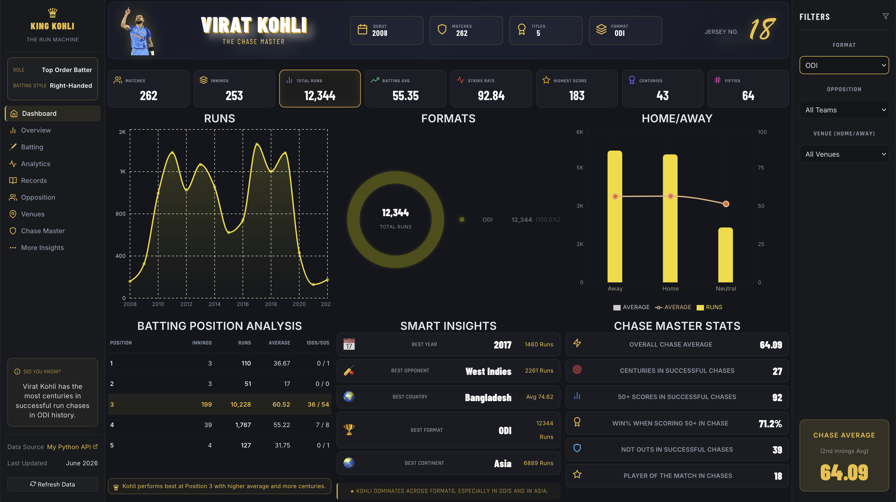

Analyzes Virat Kohli's complete ODI performance using dynamic visualizations and KPIs.

---

## 🏆 Test Dashboard

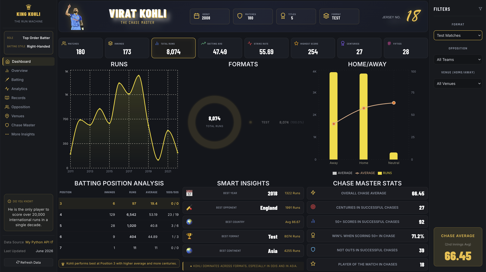

Provides detailed Test career analysis with real-time statistics and trend visualization.

---

## ⚡ T20I Dashboard

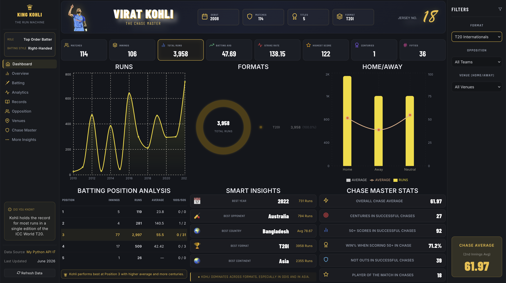

Displays T20 International batting analysis including strike rate, average and yearly performance.


---

## 🇦🇺 Australia Filter

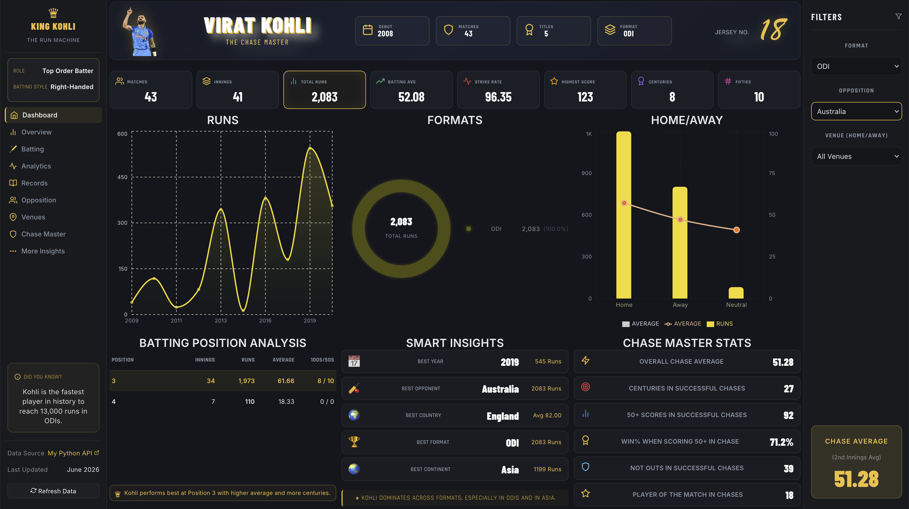

Dynamic filtering of performance against Australia.

---

## 🏴 England Filter

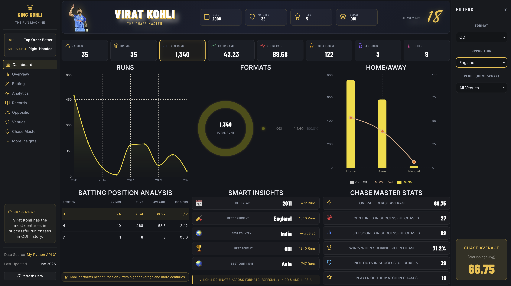

Interactive analysis of Virat Kohli's records against England.

---

## 🇵🇰 Pakistan Filter

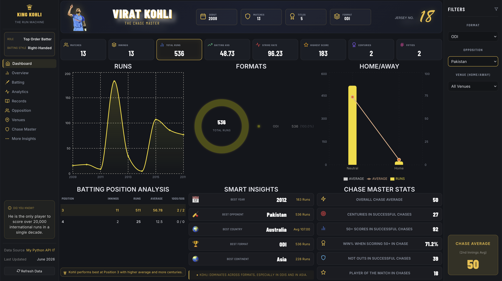

Performance analysis against Pakistan with dynamic charts.

---

## 🇿🇦 South Africa Filter

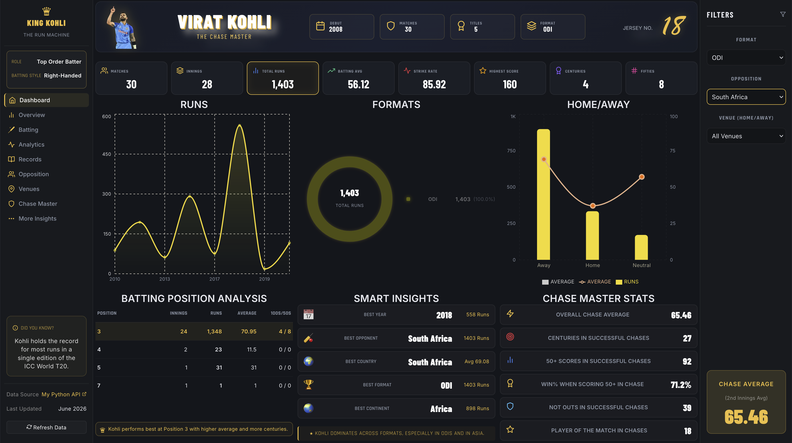

Shows batting performance against South Africa.

---

## 🇱🇰 Sri Lanka Filter

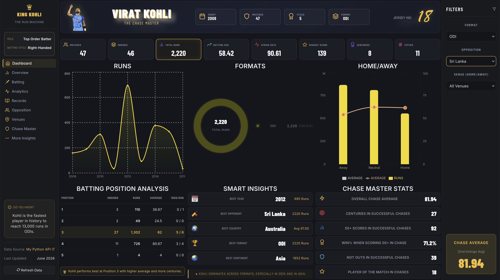

Displays batting statistics against Sri Lanka.

---

## 🏠 Home vs Away Analysis

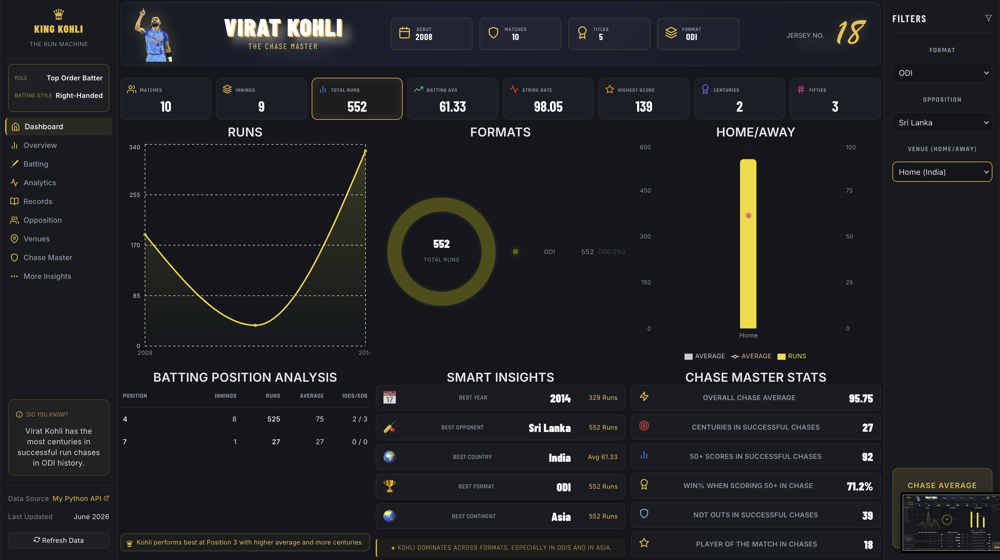

Compares Home, Away and Neutral venue performances dynamically.

---

## 💡 Smart Insights

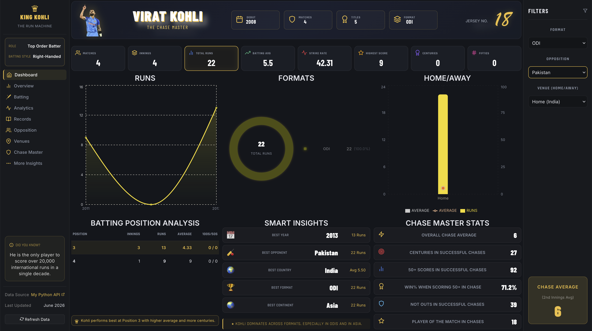

Automatically identifies:

- Best Year
- Best Opponent
- Best Country
- Best Format
- Best Continent

---

# ⚙️ Full Stack Architecture

```text
React Frontend
        │
        ▼
     REST API
        │
        ▼
      FastAPI
        │
        ▼
   SQLAlchemy ORM
        │
        ▼
       MySQL
        │
        ▼
 Dynamic SQL Queries
        │
        ▼
    JSON Response
        │
        ▼
Interactive Dashboard
```

---

# 📚 What I Learned

- React Dashboard Development
- FastAPI REST API Development
- SQLAlchemy ORM
- MySQL Query Optimization
- Dynamic Data Filtering
- Recharts Visualization
- Full Stack Integration
- Data Analytics Dashboard Design

---

# 👨‍💻 Author

**Munir Patel**

⭐ If you like this project, consider giving it a star on GitHub.
